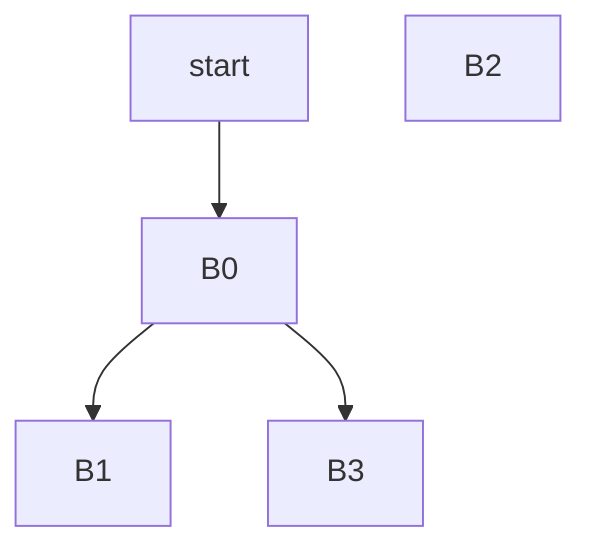

# Stage 3 Report

学号：2022010776
姓名：张瀚宸

## 实验内容

这一个stage的内容就是要实现块语句，因此核心就是在作用域。
实验指导要求实现一个`ScopeStack`，我觉得太麻烦且没必要，因此直接在`Scope`上加了一个`father`字段指向自己的父级作用域，在遇到块语句和函数的时候新建作用域并正确指向即可。
这样做有许多好处：
1. 不用实现一个`ScopeStack`，减少了代码量。
2. 不用手动退栈，因为作用域的生命周期就是函数的生命周期，因此在函数结束的时候自然就会退栈。
3. 作用域的构成与其说是栈，不如说是树，因此用`father`字段指向父级作用域更加符合实际情况。

另外本阶段还要求判断基本块的可达性。根据注释不难在相应位置加一个dfs，并在遍历时跳过。

## 思考题

```cpp
int main(){
 int a = 2;
 if (a < 3) {
     {
         int a = 3;
         return a;
     }
     return a;
 }
}
```
中间码如下：
```
FUNCTION<main>:
    _T1 = 2
    _T0 = _T1
    _T2 = 3
    _T3 = (_T0 < _T2)
    if (_T3 == 0) branch _L1
    _T5 = 3
    _T4 = _T5
    return _T4
    return _T0
_L1:
    return
```
基本块划分如下：
```
>>> B0 start <<<
FUNCTION<main>:
    _T1 = 2
    _T0 = _T1
    _T2 = 3
    _T3 = (_T0 < _T2)
    if (_T3 == 0) branch _L1
<<<  B0 end  >>>

>>> B1 start <<<
    _T5 = 3
    _T4 = _T5
    return _T4
<<<  B1 end  >>>

>>> B2 start <<<
    return _T0
<<< B2 end >>>

>>> B3 start <<<
_L1:
    return
<<<  B3 end  >>>
```
控制流图如下：
